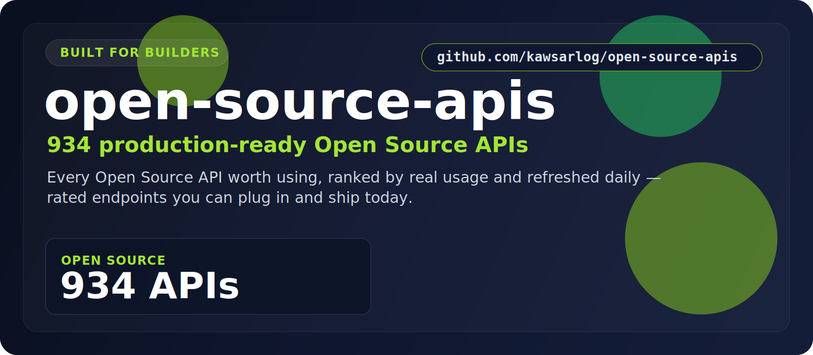

  

  <a href="#at-a-glance"><b>At a Glance</b></a> &nbsp;•&nbsp;
  <a href="#the-categories"><b>Categories</b></a> &nbsp;•&nbsp;
  <a href="#start-here"><b>Start Here</b></a> &nbsp;•&nbsp;
  <a href="#built-for"><b>Built For</b></a> &nbsp;•&nbsp;
  <a href="#why-this-repo"><b>Why This Repo</b></a>

## At a Glance

> **942** production-ready Open Source APIs.

A focused, always-fresh index of Open Source APIs for tapping repos, packages, and developer ecosystems. Every entry is rated, shows real user counts, and is refreshed daily — so you find the right one fast.

| Metric | Value |
|--------|-------|
| **Total APIs** | **942** |
| **Categories** | 1 |
| **Last updated** | 2026-07-16 |
| **Update cadence** | Daily, automated |

## The Categories

<table>
  <tr>
    <td width="100%" valign="top">
      <h3>Open Source</h3>
      
<strong>942 APIs</strong>

      
Repos, packages, and ecosystem data across open-source registries.

      
<a href="./Open_source/"><strong>Open Open Source &rarr;</strong></a>

    </td>
  </tr>
</table>

## Start Here

1. Pick the category that matches what you're building.
2. Open its folder and scan the API names, ratings, and user counts.
3. Click through to the provider page for docs, pricing, and setup.
4. Shortlist in minutes — no digging through unrelated categories.

## Explore the Stack

<strong>Open Source — 942 APIs</strong>

Repos, packages, and ecosystem data across open-source registries.

[Browse Open Source APIs &rarr;](./Open_source/)

## Built For

<table>
  <tr>
    <td width="25%" align="center"><strong>Package tooling</strong></td>
    <td width="25%" align="center"><strong>Repo analytics</strong></td>
    <td width="25%" align="center"><strong>Dependency scans</strong></td>
    <td width="25%" align="center"><strong>Dev insights</strong></td>
  </tr>
  <tr>
    <td width="25%" align="center"><strong>Registries</strong></td>
    <td width="25%" align="center"><strong>OSS research</strong></td>
    <td width="25%" align="center"><strong>Security</strong></td>
    <td width="25%" align="center"><strong>Dashboards</strong></td>
  </tr>
</table>

## Why This Repo

- **Opinionated, not exhaustive.** Only the categories that matter here — no clutter.
- **Always fresh.** A scheduled job re-scrapes the source and updates the counts daily.
- **Fast to scan.** Ratings and real usage numbers surface the APIs worth your time.
- **Consistent.** Every category follows the same clean, sortable layout.

## Star History

---

**942 APIs** across **1 categories** — updated 2026-07-16
 If this saved you time, a star helps others find it.

